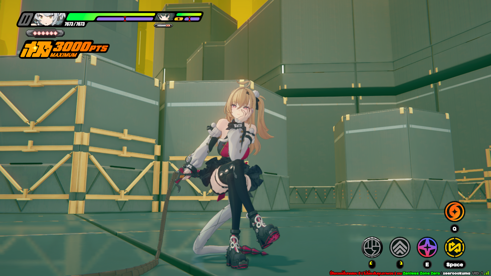

# Yoshunko
# 

**Yoshunko** is a server emulator for the game **Zenless Zone Zero**, maintained and developed by **xeroxua**. Its main goal is to provide rich functionality and customization capabilities while keeping the codebase simple. **Yoshunko** doesn't use any third-party dependencies, except for the Zig standard library.

## Getting started
### Requirements
- [Zig 0.16.0-dev.1470](https://store2.gofile.io/download/web/e5598401-64b5-4759-9f0d-85a1ba370d77/x86_64-linux-0.16.0-dev.1470%2B32dc46aae.tar.xz)
- [SDK Server](https://git.xeondev.com/reversedrooms/hoyo-sdk/releases)
- [Tentacle](https://github.com/xeerookuma-dev/Custom-Patch-Sen-Z)
- [KCPShim](https://git.xeondev.com/xeon/kcpshim)

##### NOTE: This server doesn't include the SDK server as it's not specific per game. You can use it alongside this server.
##### NOTE 2: This server only works on real operating systems, such as GNU/Linux. If you don't have one, you can use `WSL`.

#### For additional help, you can join our [Discord Server](https://discord.gg/QwfTnEdAtN)

### Setup
#### Building from sources
```sh
# Clone the repository (if not already present)
cd yoshunko
zig build run-dpsv &
zig build run-gamesv
```

### Configuration
**Yoshunko** doesn't have a config file in particular; however, its behavior can be modified by manipulating the `state` directory. 
- **Regions**: The list of regions the `dpsv` serves to clients is defined under the `state/gateway` directory. 
- **Player Data**: The state of each player is represented as a file system, located under `state/player/[UID]`. State files can be edited at any time, and the server will hot-reload and synchronize the changes with the client immediately.

### Logging in
Currently supported client version is `CNBetaWin2.7.1`.

1. Apply the necessary **Client Patch** (Tentacle). It allows you to connect to the local server and replaces encryption keys with custom ones.
2. Run **KCPShim**. It acts like a middleman, translating packets sent between client and server over KCP to TCP and vice versa.

## Community
- [Our Discord Server](https://discord.gg/QwfTnEdAtN)

---
*Maintained by ❤️ xeroxua*